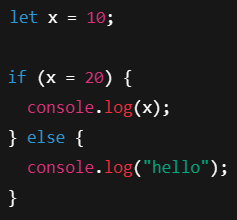
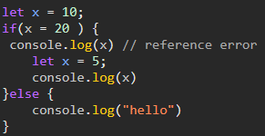
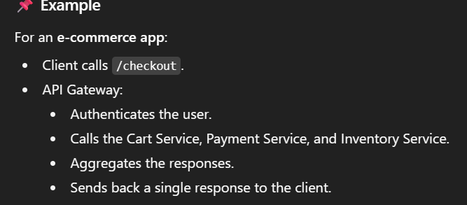
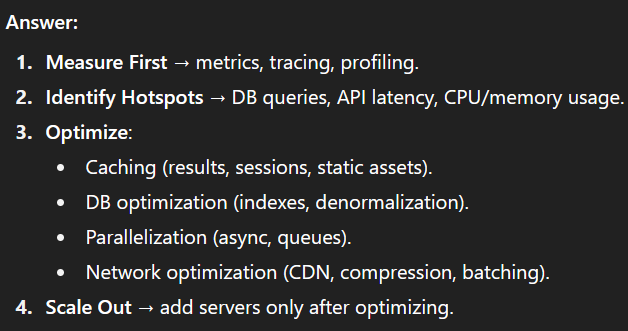

# frontend Interview Question

- ✨JAVASCRIPT ✨

## JAVASCRIPT

## 1. create a function which will increase the counter by one

It is example of IIFE, for better understand you can explore these links

- [link 1](https://stackoverflow.com/questions/35237779/difference-between-an-iife-and-non-iife-in-javascript-modular-approach)
- [link 2](www.w3schools.com/js/js_function_closures.asp)

```
const addOne = (function(){
  let counter = 0;
  return () => {
	return counter += 1;
  }
})();

addOne() // will return incremental counter
```

## 2. What are mutable and immutable types in JavaScript?

**Mutable** objects are objects **whose value can change once created**, <br/>
while **immutable** objects are those **whose value cannot change once created**.

In JavaScript :-

```
**numbers**, **strings**, **null**, **undefined** and **Booleans** are primitive types which are **immutable**. <br />
**Objects**, **arrays**, **functions**, **classes**, **maps**, and **sets** are **mutable**.
```

## 3. How to handle Callback hell?

One of the options are async/await and Promise

```
const makeBurger = async () => {
  const beef = await getBeef();
  const cookedBeef = await cookBeef(beef);
  const buns = await getBuns();
  const burger = await putBeefBetweenBuns(cookedBeef, buns);
  return burger;
};

// Make and serve burger
makeBurger().then(serve);
```

with error handling

```
const summerActivities = async () => {
  try {
    const result = await fightTheDemogorgon();
    const seasonsLeft = await rollForDamage(result);
    const finalResult = await closeTheGateIn(seasonsLeft);
    console.log('Hawkins is safe for ' + finalResult + ' more seasons.'));
  } catch (e) {
    failureCallback();
  }
}

```

## 4. What is Functional Programming?

Functional programming rules :-

1. Keep your data and function totaly separate.

```
let score = 100;

function addBonus(){
 score = score + 10;
 return score;
}

v/s

// functional approach =>

function addBonus( score ) {
 return score + 10;
}

later function is functional programming approach. Benefits for this

1. It is testable
2. It is not dependent on global variable.
3. Self in take function.


2. don't update same variable again.

```

## 5. what are synthetic event in React?

## 6. dynamic vs static typing typescript

## 7. custom hook pattern react

## 8. what is microservices?

## 9. micro frontend vs monolith

## 10. react HOC patterns

## 11. useref react

## 12. usecallback react

## 13. functional programming vs oop

## 14. functional programming core concepts

## 15. what is the output of the following program?

var x = "asdf zxcv";
x[1] = "h";
console.log(x[1]);

## 16. what will be the output?

async function foo() {
return 1
}

## 17. what will be the output?

var x = { a: 1, b: 2};
var y = x;
y.a = 42;
delete y.b

console.log(x.a, x.b)

In a React JavaScript Fundamentals full stack L1 round the interviewer asked a following questions.

⭐ What is Prototype?

⭐ What is the difference between de-bouncing and throttling?

⭐ What is a temporal dead zone?

⭐ What is the output for following code.
👉 const a = {"x":1, "b":2};
a.x = 9;
👉 const b = {"x": 2, b:4};
b.y = {"v":5, "t": 8};

⭐ What is a useEffect hook?

⭐ What are the difference between these patterns.
👉 useEffect((), [a,b]);
👉 useEffect((), []);
👉 useEffect(());

⭐ What is the difference between useMemo() and useCallback?

⭐ I want to implement a function `npower` which takes a parameter and throw the result in an array with the power of each elements from the input array? So npower function is a new built in function need to add.
👉 Input: [1,2,3].npower(3)
👉 Output: [1,8,21]

⭐ What would be the output<br>


👉 How if interprets it

In JS, if(condition) evaluates the truthiness of the value.

After assignment, x = 20 returns 20 (the assigned value).

20 is truthy (any non-zero number is truthy).

So the if branch executes.

👉 Step-by-step execution:

```
let x = 10; → x is 10

x = 20 → x is now 20

if (x = 20) → evaluates as if (20) → truthy → enter if block

console.log(x) → prints 20
```

⭐ How to Print 20 as well 5 as an output using closure?<br>


👉

```
let x = 10;

if (x = 20) {
  console.log(x); // ✅ prints 20 (outer x)

  (() => {
    let x = 5;     // new block-scoped x (closure)
    console.log(x); // ✅ prints 5
  })();
} else {
  console.log("hello");
}
```

⭐ once I pushed code how it will go to SIT server with pipeline and deployment?
🔹 Typical Flow: Push → SIT Deployment

1. Developer Pushes Code

You push your changes to a Git repo (GitHub, GitLab, Bitbucket, Azure Repos, etc.).

Usually the branch matters:

feature/\* → for development/testing

develop → often used to trigger SIT deployments

main/master → usually for UAT/Prod

2. CI Pipeline is Triggered

A CI/CD tool (Jenkins, GitHub Actions, GitLab CI, Azure DevOps, CircleCI, etc.) is configured to listen for pushes/PR merges.

Example:

Push to develop branch → start SIT pipeline.

3. Pipeline Stages

A typical pipeline for SIT looks like:

🔸 a) Build Stage

Install dependencies (npm install, mvn install, etc.).

Run build (npm run build, mvn package, etc.).

Produce build artifacts (e.g., React build/, JAR/WAR, Docker image).

🔸 b) Test Stage

Unit tests (jest, junit, etc.).

Integration tests (mocked APIs, DBs).

Linting & static analysis.

🔸 c) Package Stage

Artifacts are stored (e.g., in Nexus, Artifactory, or a Docker Registry like ECR/GCR/ACR).

Example:

React → build.zip → uploaded to artifact storage.

Spring Boot → app.jar → uploaded.

Docker → image tagged myapp:develop-123 and pushed to registry.

4. Deployment Stage

Now comes the CD part (Continuous Deployment):

Options:

VM/Server Deployment

Pipeline copies the build to SIT servers (via SSH/Ansible/Octopus).

Runs commands like:

scp build.zip user@sit-server:/var/www/app
ssh user@sit-server "unzip -o /var/www/app/build.zip && systemctl restart app"

Container Deployment

Docker image is deployed to SIT via Kubernetes, ECS, AKS, or Docker Swarm.

Example (Kubernetes):

kubectl set image deployment/myapp myapp=myregistry/myapp:develop-123 --namespace=sit

Cloud Deployment

For cloud-native apps: CD pushes build to SIT environment in AWS, GCP, or Azure.

Could be S3 + CloudFront (for React apps), Elastic Beanstalk, or App Service.

5. Verification

Health checks run (probes in K8s, smoke tests, API ping tests).

SIT testers get notified via Slack/Email that a new build is deployed.

🔹 Example Flow in Plain English

You push to develop.

Jenkins detects push and runs pipeline.

Code is built → unit tests run → Docker image created.

Image myapp:develop-45 is pushed to registry.

Jenkins triggers a deploy job → updates SIT Kubernetes namespace with the new image.

SIT server starts running the new version.

SIT testers open the SIT URL and test.

[ Git Push ]
↓
[ CI/CD Tool (Jenkins/GitLab/etc.) ]
↓
┌─────────────┬───────────────┬───────────────┐
│ Build │ Test │ Package │
│ (npm/mvn) │ (jest/junit) │ (Docker/ZIP) │
└─────────────┴───────────────┴───────────────┘
↓
[ Deploy to SIT Server/K8s ]
↓
[ SIT Environment Ready ]

⭐ GitLab CI/CD or GitHub Actions that builds and deploys a React/Node app to a SIT server

🚀 GitLab CI/CD Example – React (frontend) + Node (backend) Deploy to SIT

```
stages:
  - build
  - test
  - deploy

variables:
  NODE_ENV: production
  FRONTEND_DIR: frontend
  BACKEND_DIR: backend

# Cache node_modules to speed up builds
cache:
  paths:
    - node_modules/
    - ${FRONTEND_DIR}/node_modules/
    - ${BACKEND_DIR}/node_modules/

# ---------- Build Stage ----------
build_frontend:
  stage: build
  image: node:18
  script:
    - cd $FRONTEND_DIR
    - npm ci
    - npm run build
  artifacts:
    paths:
      - $FRONTEND_DIR/build
    expire_in: 1 week

build_backend:
  stage: build
  image: node:18
  script:
    - cd $BACKEND_DIR
    - npm ci
    - npm run build
  artifacts:
    paths:
      - $BACKEND_DIR/dist
    expire_in: 1 week

# ---------- Test Stage ----------
test_backend:
  stage: test
  image: node:18
  script:
    - cd $BACKEND_DIR
    - npm ci
    - npm test

# ---------- Deploy Stage ----------
deploy_sit:
  stage: deploy
  image: alpine:latest
  before_script:
    - apk add --no-cache openssh
  script:
    # Copy frontend build & backend dist to SIT server
    - scp -o StrictHostKeyChecking=no -r $FRONTEND_DIR/build user@sit-server:/var/www/react-app
    - scp -o StrictHostKeyChecking=no -r $BACKEND_DIR/dist user@sit-server:/var/www/node-app
    # Restart backend service (assuming systemd or pm2)
    - ssh -o StrictHostKeyChecking=no user@sit-server "pm2 restart node-app || pm2 start /var/www/node-app/index.js --name node-app"
  only:
    - develop
```

✅ Flow:

- Build frontend & backend separately.
- Run tests for backend.
- Deploy artifacts to SIT server over SSH.
- Restart backend process with PM2.

🚀 GitHub Actions Example – React + Node Deploy to SIT

```
name: CI/CD React + Node to SIT

on:
  push:
    branches: [ "develop" ]

jobs:
  build:
    runs-on: ubuntu-latest
    strategy:
      matrix:
        node-version: [18]
    steps:
      - uses: actions/checkout@v3

      # ---------- Frontend ----------
      - name: Install & Build Frontend
        working-directory: ./frontend
        run: |
          npm ci
          npm run build

      # ---------- Backend ----------
      - name: Install & Build Backend
        working-directory: ./backend
        run: |
          npm ci
          npm run build

      - name: Upload Artifacts
        uses: actions/upload-artifact@v3
        with:
          name: build-artifacts
          path: |
            frontend/build
            backend/dist

  deploy:
    runs-on: ubuntu-latest
    needs: build
    steps:
      - uses: actions/download-artifact@v3
        with:
          name: build-artifacts
          path: ./deploy

      - name: Deploy to SIT via SSH
        uses: appleboy/ssh-action@v0.1.6
        with:
          host: ${{ secrets.SIT_SERVER_HOST }}
          username: ${{ secrets.SIT_SERVER_USER }}
          key: ${{ secrets.SSH_PRIVATE_KEY }}
          script: |
            mkdir -p /var/www/react-app /var/www/node-app
            rm -rf /var/www/react-app/* /var/www/node-app/*
            cp -r deploy/frontend/build/* /var/www/react-app/
            cp -r deploy/backend/dist/* /var/www/node-app/
            pm2 restart node-app || pm2 start /var/www/node-app/index.js --name node-app

```

✅ Flow:

Build React & Node.

Store artifacts between jobs.

Deploy to SIT using SSH with secrets stored in GitHub.

Restart Node app with PM2.

⭐ What is Accessibility?
Accessibility means designing and developing your website or React app so that people with visual, auditory, motor, or cognitive impairments can still interact with it effectively.

It’s not just about compliance — it’s about inclusivity.

🔹 Why it Matters

Legal requirements (e.g., ADA, WCAG standards).

Larger audience → more users can access your app.

Better UX for everyone (e.g., keyboard shortcuts help power users too).

1. Visual Impairments

Blind users rely on screen readers (NVDA, JAWS, VoiceOver).

Color-blind users need good color contrast and not just color-coded indicators.

✅ Example: Use aria-label or semantic HTML.

```
<button aria-label="Close modal">❌</button>

```

2. Hearing Impairments

Users with hearing loss can’t consume audio-only content.

✅ Example: Add captions or transcripts to videos.

3. Motor Disabilities

Some users can’t use a mouse — they navigate with keyboard or assistive devices.

✅ Example: Ensure focus states and tab order are logical.

```
<button>Submit</button>  {/* reachable via Tab */}
```

4. Cognitive Impairments

Users may struggle with complex layouts, jargon, or fast animations.

✅ Example: Provide simple, clear instructions and allow users to disable animations.

🔹 How to Make React Apps Accessible

1. Use Semantic HTML (<button>, <header>, <nav>) instead of <div> everywhere.
2. ARIA attributes to give more meaning where semantics aren’t enough.

```
<div role="alert">Error: Invalid email</div>
```

3. Keyboard accessibility: Make sure all elements are tabbable and operable with Enter/Space.
4. Color contrast: Use tools to ensure WCAG contrast ratios.
5. Alt text for images.

```


```

6. Skip navigation links for screen readers.
7. Form labels properly linked to inputs.

```
<label htmlFor="email">Email</label>
<input id="email" type="email" />
```

8. Test with screen readers and keyboard only.

🔹 Tooling for Accessibility

- Lighthouse (Chrome DevTools) → runs accessibility audits.
- axe DevTools (browser extension).
- react-aria, reach-ui → libraries that build accessible components.

🔹 In Short

Accessibility = apps for everyone.

Visual (screen readers, color contrast).

Hearing (captions).

Motor (keyboard navigation).

Cognitive (clear layouts, less motion).

It’s not an afterthought — it should be built into your dev process.

⭐ Web security
Web security is about protecting your app, your users, and your infrastructure from attacks like XSS, CSRF, SQL injection, token theft, etc.

🔹 1. Authentication & Authorization
Use JWT or OAuth2 properly → short-lived access tokens, refresh tokens in HttpOnly cookies.
Role-Based Access Control (RBAC) → check permissions server-side, not just in React.
Never trust the frontend for authorization (React can be bypassed easily).

🔹 2. Secure Token Storage

Access token → in memory (or localStorage with caution).

Refresh token → HttpOnly, Secure, SameSite cookie.

Avoid putting tokens in query params (leaks via logs & referrers).

🔹 3. Protect Against XSS (Cross-Site Scripting)

Never use dangerouslySetInnerHTML in React unless sanitized.

Use libraries like DOMPurify if you must inject HTML.

Escape user input on server before rendering.

Set security headers:

Content-Security-Policy: default-src 'self'
X-XSS-Protection: 1; mode=block

🔹 4. Protect Against CSRF (Cross-Site Request Forgery)

Use SameSite cookies (SameSite=Strict or Lax).

If you need cross-site requests → add CSRF tokens (hidden token sent with every request, validated server-side).

🔹 5. Input Validation & Sanitization

On backend: validate all inputs using libraries like Joi, Zod, or yup.

Prevent SQL Injection → use ORM or parameterized queries.

Prevent NoSQL Injection → whitelist allowed query fields.

🔹 6. HTTPS Everywhere

Always serve over HTTPS (TLS).

Redirect http:// → https://.

Use HSTS header:

Strict-Transport-Security: max-age=31536000; includeSubDomains; preload

🔹 7. Secure Deployment & CI/CD

Don’t hardcode secrets → use environment variables or secret managers (Vault, AWS Secrets Manager).

Rotate secrets/keys regularly.

Limit CI/CD pipeline permissions.

Use linting/security scanners (npm audit, Snyk, OWASP ZAP).

⭐ What are the differences between client side and server side rendering ?

🔹 Client-Side Rendering (CSR)

👉 Rendering happens in the browser using JavaScript (React, Angular, Vue).

How it works

Browser loads an empty HTML shell + JS bundle.

React/JS runs → builds the DOM → displays UI.

Data fetched from APIs asynchronously and injected into the DOM.

🔹 What is Hydration?

When you use Server-Side Rendering (SSR) or Static Site Generation (SSG):

The server sends HTML that’s already rendered.

The browser shows that HTML immediately (fast first paint ✅).

But that HTML is static — it looks correct, but it has no interactivity yet (buttons, inputs, routing won’t work).

👉 Hydration is the process where React’s JavaScript attaches event listeners and makes that static HTML “come alive.”

What is Hydration Time?

Its the time taken by React to :

1. Download the JS bundle
2. Parse and Execute it
3. Reconcile the static DOM with React's Virtual dom
4. Attach event listeners to elements
   Only after hydration completes can the user properly interact with the page.

For example, when we use Next.js (SSR):

```
export default function Page() {
  return <button onClick={() => alert("Clicked!")}>Click Me</button>;
}
```

On first load:

Server sends HTML:

```
<button>Click Me</button>

```

✅ Looks right but not clickable yet.

Browser downloads React JS bundle.

React hydrates → attaches the onClick handler.

Now the button works.

👉 The delay between seeing the button and being able to click it = hydration time.

🔹 Why Hydration Time Matters

Long hydration times = bad UX → users see the page but can’t interact yet.

It gets worse with:

- Large JS bundles
- Complex pages
- Low-end devices

🔹 Ways to Reduce Hydration Time

1. Code splitting (load only what’s needed).
2. Lazy loading components.
3. Partial hydration / islands architecture (Astro, React Server Components).
4. Streaming SSR (React 18+ → stream HTML in chunks).
5. Use CDN for faster JS delivery.

✅ In short:
Hydration time = the delay after the page first renders (SSR/SSG) but before React JS makes it interactive.

⭐ what is paint and repaint a page
🔹 How Browsers Render a Page (Simplified Pipeline)

When you load a webpage, the browser does this:

Parse HTML → DOM tree

Parse CSS → CSSOM tree

Combine DOM + CSSOM → Render tree

Layout (calculate positions, sizes of elements)

Paint (fill pixels: colors, borders, text, images)

Composite (layering, z-index, GPU acceleration)

🔹 What is Paint?

👉 Paint is when the browser takes all the styles (colors, borders, shadows, text) and draws pixels on the screen.

Example: First time rendering the page → initial paint (a.k.a. First Paint, First Contentful Paint).

It’s literally when you see something appear for the first time.

🔹 What is Repaint?

👉 Repaint happens when something visual changes but doesn’t affect layout/geometry.

Example:

```
button:hover {
  background-color: red;
}
```

When you hover, the background changes → browser doesn’t need to recalculate layout, it just repaints the pixels.

Cheap compared to layout changes.

🔹 What is Reflow (important difference)?

If you change something that affects the geometry/layout (width, height, position), the browser must recalculate layout.

This triggers a reflow → which often also triggers a repaint.

✅ In short:

1. Paint = first time pixels drawn.
2. Repaint = redraw due to visual style changes.
3. Reflow = layout recalculation → usually followed by repaint.

⭐ explain the JavaScript Event Loop
the JavaScript Event Loop is one of the most important concepts to understand how JS handles asynchronous code (like setTimeout, Promises, fetch).

🔹 2. The Big Players

- Call Stack → Where synchronous JS code runs (function execution).
- Web APIs (browser / Node APIs) → Handle async tasks (setTimeout, fetch, DOM events).
- Callback Queue (Macrotask Queue) → Stores callbacks from async tasks (setTimeout, setInterval).
- Microtask Queue → Stores promises (.then, catch, finally, queueMicrotask).
- Event Loop → The “traffic controller” that decides what runs next.

🔹 3. Event Loop Workflow

1. JS runs synchronous code in the call stack.
2. Async tasks (timers, network requests) are sent to Web APIs.
3. When async work is done → callback/promise is placed in a queue.

- Macrotask queue → setTimeout, DOM events.
- Microtask queue → Promises, MutationObserver.

4. Event Loop checks:
   -If stack is empty → take all microtasks first.

Then take one macrotask.

- Repeat infinitely.

```
console.log('begins')

setTimeout(() => {
	console.log('1st settimeout')
	Promise.resolve('success').then(() => {
		console.log('1st Promise')
	})
})

new Promise((resolve, reject) => {
	console.log('2nd Promise')
	setTimeout(() => {
		console.log('2nd settimeout')
		resolve('2nd Promise settimeout')
	})
}).then(res => {
	console.log('2nd Promise then')
	console.log(res)
})
console.log('end')
```

⭐ how to split big compiled code to smaller chunks?

- Instead of shipping one big bundle.js, you break it into multiple chunks.
- Browser loads only the chunks needed for the current page.
- Other chunks are fetched on demand (lazy loading).

🔹 1. Code Splitting in React (Dynamic Import)
React supports lazy loading with React.lazy + Suspense.

🔹 2. Route-Based Splitting
If using React Router, you can split per route:

🔹 3. Webpack Code Splitting
if using Webpack directly:
Use import() instead of require → Webpack auto-splits.
Example:

```
import("./math").then(math => {
  console.log(math.add(2, 3));
});
```

Webpack generates a new chunk like math.bundle.js.
Also enable SplitChunksPlugin:

```
optimization: {
  splitChunks: {
    chunks: "all",
  },
}
```

🔹 4. Vite / Rollup
In Vite or Rollup, code splitting is automatic when you use import().

```
const module = await import("./utils.js");
```

👉 Creates a separate file utils-[hash].js.

⭐what is web socket?

A WebSocket is a communication protocol that provides a full-duplex (two-way), persistent connection between a client (like a web browser) and a server over a single TCP connection.

Unlike HTTP, which is request–response based (the client asks, and the server responds), WebSockets allow both the server and client to send data to each other at any time, without repeatedly opening new connections.

Key Features:

Full-duplex: Both client and server can communicate simultaneously.

Persistent connection: Once established, the connection remains open until explicitly closed.

Low latency: Reduces the overhead of repeatedly opening and closing HTTP connections.

Efficient: Uses less bandwidth for real-time communication compared to polling or long-polling.

How it works:

A client sends an HTTP request to the server asking to "upgrade" the connection to WebSocket.

If the server supports it, the protocol is switched from HTTP to WebSocket.

From then on, both sides can send messages freely until the connection is closed.

Common Use Cases:

Chat applications (WhatsApp Web, Slack, etc.)

Live notifications (social media alerts, stock price updates)

Online multiplayer games

Collaborative editing tools (like Google Docs real-time updates)

Live dashboards (monitoring systems, financial trading platforms)

⚡ In short: WebSocket is what makes real-time communication on the web fast and efficient.

⭐ how to implement JWT token in react app

Implementing JWT (JSON Web Token) authentication in a React app involves several steps. JWT is usually issued by a backend server after a successful login and then stored on the client-side (React) to authorize further requests. Here's a step-by-step guide:

1. Setup your backend
   You need a backend API that supports JWT authentication. For example, Node.js + Express:

```
// Example: Node.js + Express + JWT
const express = require('express');
const jwt = require('jsonwebtoken');
const bodyParser = require('body-parser');
const app = express();
app.use(bodyParser.json());

const SECRET_KEY = 'your_secret_key';

// Dummy user
const user = { id: 1, username: 'test', password: 'password' };

app.post('/login', (req, res) => {
  const { username, password } = req.body;
  if (username === user.username && password === user.password) {
    const token = jwt.sign({ id: user.id, username: user.username }, SECRET_KEY, {
      expiresIn: '1h',
    });
    return res.json({ token });
  }
  return res.status(401).json({ message: 'Invalid credentials' });
});

// Protected route
app.get('/protected', (req, res) => {
  const token = req.headers['authorization']?.split(' ')[1];
  if (!token) return res.status(401).json({ message: 'Token required' });
  try {
    const decoded = jwt.verify(token, SECRET_KEY);
    res.json({ message: 'Protected data', user: decoded });
  } catch (err) {
    res.status(403).json({ message: 'Invalid token' });
  }
});

app.listen(5000, () => console.log('Server running on port 5000'));
```

2. Login and store JWT in React

```
import axios from 'axios';
import { useState } from 'react';

function Login() {
  const [username, setUsername] = useState('');
  const [password, setPassword] = useState('');

  const handleLogin = async () => {
    try {
      const res = await axios.post('http://localhost:5000/login', {
        username,
        password,
      });
      localStorage.setItem('token', res.data.token); // store token
      alert('Login successful');
    } catch (err) {
      alert('Login failed');
    }
  };

  return (
    <div>
      <input
        type="text"
        placeholder="Username"
        value={username}
        onChange={(e) => setUsername(e.target.value)}
      />
      <input
        type="password"
        placeholder="Password"
        value={password}
        onChange={(e) => setPassword(e.target.value)}
      />
      <button onClick={handleLogin}>Login</button>
    </div>
  );
}

export default Login;

```

3. Use JWT to access protected routes

```
const token = localStorage.getItem('token');

const fetchProtectedData = async () => {
  try {
    const res = await axios.get('http://localhost:5000/protected', {
      headers: { Authorization: `Bearer ${token}` },
    });
    console.log(res.data);
  } catch (err) {
    console.error('Error fetching protected data', err);
  }
};

```

4. Protecting Routes in React

```
import { Navigate } from 'react-router-dom';

function PrivateRoute({ children }) {
  const token = localStorage.getItem('token');
  return token ? children : <Navigate to="/login" />;
}

// Usage
<Routes>
  <Route path="/login" element={<Login />} />
  <Route
    path="/dashboard"
    element={
      <PrivateRoute>
        <Dashboard />
      </PrivateRoute>
    }
  />
</Routes>
```

Use HTTP-only cookies instead of localStorage for better security.

Handle token expiration and refresh tokens.

Never store sensitive data in localStorage.

Always validate JWT on the server side.

⭐Monorepos (Nx, Lerna) vs Micro-Frontends vs Atomic Design

1. Monorepos (Nx, Lerna)
   What it is:

A monorepo is a single repository that contains multiple projects or packages. Tools like Nx or Lerna help manage dependencies, build processes, and versioning across multiple apps and libraries.

Key Features:

Single repo for multiple apps/libraries (frontend + backend possible).

Shared code/libraries across projects.

Centralized dependency management.

Tooling for incremental builds and caching (Nx especially).

When to use:

Large teams working on multiple apps or shared UI libraries.

You want code reuse and consistent tooling across projects.

```
monorepo/
├── apps/
│   ├── web-app/
│   └── admin-dashboard/
├── libs/
│   ├── ui-components/
│   └── utils/
```

web-app and admin-dashboard can both import ui-components from libs/.

Nx can run build, test, and lint only for affected apps.

2. Micro-Frontends
   What it is:

A Micro-Frontend splits a frontend app into independently deployable, smaller frontends, often owned by different teams. It’s inspired by microservices for the backend.

Key Features:

Each micro-frontend is self-contained (UI, state, routing, API calls).

Teams can develop, deploy, and scale independently.

Can be integrated using module federation, iframes, or web components.

When to use:

Large applications with multiple teams needing independent release cycles.

Apps where different parts have different tech stacks (e.g., React + Vue).

```
web-app/
├── header-mf/   (React)
├── dashboard-mf/ (Angular)
├── settings-mf/ (React)

```

header-mf and dashboard-mf are deployed independently.

The main shell app stitches them together at runtime.

⭐what is Progressive Web Apps?
A Progressive Web App (PWA) is a type of web application that behaves like a native mobile or desktop app while still being accessed via a browser. PWAs combine the reach of the web with the experience of an app, providing features like offline access, push notifications, and fast load times.

1. Key Characteristics of PWAs

Progressive – Works for every user, regardless of browser, using progressive enhancement.

Responsive – Adapts to different screen sizes: mobile, tablet, desktop.

Connectivity Independent – Can work offline or on poor networks using service workers.

App-like – Feels like a native app with app-style navigation and interactions.

Fresh – Updates automatically in the background.

Safe – Served via HTTPS to prevent tampering.

Discoverable – Can be found via search engines like any web page.

Re-engageable – Supports push notifications to re-engage users.

Installable – Can be added to home screen without going through an app store.

Linkable – Can be shared via URL, no installation required.

2. Core Technologies Behind PWAs

| Feature             | Technology                                         |
| ------------------- | -------------------------------------------------- |
| Offline support     | Service Workers                                    |
| App manifest        | `manifest.json` for metadata (name, icon, theme)   |
| Push notifications  | Web Push API                                       |
| HTTPS               | Secure connection                                  |
| Background sync     | Service Workers for deferred operations            |
| Home screen install | Add to Home Screen via manifest and service worker |

3. Example PWA Structure
   my-pwa/
   ├── index.html
   ├── app.js
   ├── manifest.json
   └── service-worker.js

manifest.json

```
{
"name": "My PWA App",
"short_name": "PWAApp",
"start_url": "/",
"display": "standalone",
"background_color": "#ffffff",
"theme_color": "#317EFB",
"icons": [
{
"src": "/icons/icon-192.png",
"sizes": "192x192",
"type": "image/png"
},
{
"src": "/icons/icon-512.png",
"sizes": "512x512",
"type": "image/png"
}
]
}
service-worker.js
self.addEventListener('install', (event) => {
console.log('Service Worker installed');
});

self.addEventListener('fetch', (event) => {
event.respondWith(
caches.match(event.request).then((response) => {
return response || fetch(event.request);
})
);
});
```

4. Benefits of PWAs

Offline usage → Users can continue interacting even without a network.

Faster loading → Service workers cache content for instant load.

Lower development cost → One codebase for web and app-like experience.

Push notifications → Engage users like native apps.

No app store approval → Users can “install” directly from the browser.

⭐what is currying and where to use in daily developer life?
Currying is one of those functional programming concepts that sounds academic but is actually super practical in a developer’s daily work. Let’s break it down in plain terms with examples.

1. What is Currying?

👉 Definition:
Currying is the process of transforming a function that takes multiple arguments into a series of functions that each take a single argument.

Example (normal function):

```
function add(a, b) {
  return a + b;
}

console.log(add(2, 3)); // 5

```

Example (curried version):

```
function curriedAdd(a) {
  return function (b) {
    return a + b;
  };
}

console.log(curriedAdd(2)(3)); // 5

```

Or using arrow functions:
const curriedAdd = a => b => a + b;

⭐Memory leaks & garbage collection basics
understanding memory leaks and garbage collection (GC) is essential for writing efficient applications (especially in long-running apps like React SPAs, servers, or Node.js processes).

Let’s break it down:
🔹 1. Memory Basics in JS

Every time you create a variable, object, function, or closure, memory is allocated.

When nothing references that memory anymore, it becomes garbage.

JavaScript engines (like V8 in Chrome/Node.js) use automatic garbage collection (GC) → you don’t manually free memory like in C/C++.

🔹 2. Garbage Collection Basics

GC works by checking reachability:

If a value can still be reached from roots (like global variables, active functions, closures, or the call stack), it’s kept.

If not → GC reclaims it.

Example:

```
let obj = { name: "Alice" };
obj = null; // previous object is unreachable → garbage collected

```

🔹 3. What is a Memory Leak?

A memory leak happens when memory is unintentionally kept reachable, preventing GC from freeing it.
Over time, memory usage grows → performance drops.

🔹 4. Common Causes of Memory Leaks in JS
1️⃣ Global Variables

Accidentally attaching stuff to window.

```
window.leak = "oops"; // never collected unless manually deleted
```

2️⃣ Uncleared Timers / Intervals

```
setInterval(() => {
  console.log("Running...");
}, 1000);
// ❌ if not cleared → keeps running, keeps references alive
```

Fix

```
const id = setInterval(...);
clearInterval(id);
```

3️⃣ Event Listeners not removed

⭐ Architecture-Level Questions & Answers (for Experienced Professionals)

1. How do you approach designing a system for high availability?

- Redundancy: Deploy multiple instances across availability zones/regions.
- Load Balancing: Distribute traffic intelligently (layer-4/7 load balancers, DNS).
- Failover Mechanisms: Automatic rerouting when a service/node fails.
- Data Replication: Multi-region DB replication, quorum writes for consistency.
- Monitoring & Alerts: Proactive detection of failures.
- Chaos Testing: Verify resiliency with controlled failures (e.g., Chaos Monkey).

2. What factors do you consider when choosing between SQL and NoSQL?

- SQL (Relational DBs): Strong consistency, complex queries, ACID transactions → good for financial systems, reporting.
- NoSQL: High scalability, flexible schema, distributed by design → good for real-time apps, IoT, analytics, caching.

3. How would you design a system to handle millions of users concurrently?

- Load Balancing + Horizontal Scaling → add servers as demand grows.
- Stateless Services → store session data in Redis or external stores.
- Message Queues (Kafka, RabbitMQ) → decouple services and smooth traffic spikes.
- Caching (CDN, Redis, Memcached) → reduce DB load.
- Database Sharding + Replication → scale reads/writes.
- Event-Driven Architecture → asynchronous workflows.

4. what is micro service?
   A microservice is a way of designing software where a large application is split into many small, independent services. Each service:

- Does one thing well (e.g., payments, user profiles, search).
- Runs independently — can be built, deployed, and scaled without affecting others.
- Communicates with others over lightweight APIs (often REST, gRPC, or messaging systems like Kafka).
- Owns its own data — ideally, each service manages its own database to reduce tight coupling.

Example (E-commerce System)

Instead of one big app, you’d split it into:

User Service – handles registration, login.

Product Service – manages product catalog.

Order Service – handles order placement.

Payment Service – processes payments.

Notification Service – sends emails/SMS.

Each service has its own database and communicates via APIs or a message bus.

✅ Analogy:
Think of a restaurant. In a monolith, one person does cooking, serving, billing, cleaning — if they get sick, the whole restaurant stops.
In microservices, different people handle cooking, serving, billing, cleaning — they specialize, work independently, and the restaurant keeps running even if one person takes a break.

5. What strategies would you use to migrate a monolith to microservices?

- incrementally replace parts of the monolith with services.
- split schemas gradually; avoid distributed transactions early.
- logging, tracing, monitoring across services.

6. what is api gateway
   An API Gateway is like the front door to a system built with many backend services (such as microservices). It sits between the clients (web, mobile, IoT apps) and your backend services, managing and routing all requests.

✅ Analogy:
Think of an API Gateway as an airport terminal. Instead of passengers wandering directly to planes (services), they go through the terminal (gateway) where security checks, ticket validation, and directions happen. The terminal then sends them to the correct gate (service).
<br>


7. How do you design secure enterprise systems?

- Authentication/Authorization: OAuth2.0, JWT, RBAC/ABAC.
- Data Security: Encrypt in transit (TLS), at rest (AES).
- Zero Trust Principles: Verify every request, even inside the network.
- API Security: Input validation, rate limiting, WAF.
- Secrets Management: Vaults instead of hardcoded credentials.
- Compliance: GDPR, HIPAA, SOC2 depending on domain.

8. What is RBAC/ABAC.

| Feature            | RBAC (Role-Based)               | ABAC (Attribute-Based)                              |
| ------------------ | ------------------------------- | --------------------------------------------------- |
| Control Basis      | User’s role                     | User, resource, and environment attributes          |
| Flexibility        | Moderate                        | High (fine-grained)                                 |
| Ease of Management | Simple                          | Complex                                             |
| Best for           | Small/medium orgs, stable roles | Large orgs, dynamic rules, compliance-heavy systems |

9.  How do you approach performance bottlenecks in large-scale systems? <br>
    

10. how to optimization DB
    Optimizing a database is all about making queries faster, cheaper, and more reliable as your data and users grow. It usually combines schema design, query tuning, indexing, caching, and scaling strategies.

🔑 1. Schema & Data Model Optimization

- Normalize for consistency: Remove redundant data (e.g., separate users and orders).
- Denormalize for performance: Sometimes join-heavy queries are too slow → duplicate some fields or use summary tables.
- Choose right data types: Use INT instead of BIGINT if possible; avoid TEXT/BLOB unless necessary.
- Partitioning/sharding: Split large tables by range, hash, or key (e.g., users by region).

⚡ In short:

- Design smart schemas.
- Index wisely.
- Tune queries.
- Cache aggressively.
- Scale horizontally when needed.

11. What are some key design principles you follow as an architect?

Answer:

- Scalability → design for horizontal scaling.

- Resilience → graceful failure handling, retries, circuit breakers.
- Loose Coupling → services interact via contracts, not shared state.
- Observability → monitoring, logging, tracing from day one.
- Simplicity → avoid overengineering; start with the simplest solution.
- Security by Design → not as an afterthought.

⭐ how to do seo in react app
SEO (Search Engine Optimization) in a React app can be tricky because React apps are usually Single Page Applications (SPAs), which rely heavily on JavaScript. Search engines may struggle to index content that is rendered only on the client side.

🔹 1. Use Server-Side Rendering (SSR) or Static Site Generation (SSG)

- Problem: React apps often serve a blank <div> with JavaScript that later hydrates → search engines may not see full content.
- 🔹 2. Manage Metadata (Title, Description, Open Graph)

```
import { Helmet } from "react-helmet-async";

function HomePage() {
 return (
   <>
     <Helmet>
       <title>Best React SEO Guide</title>
       <meta name="description" content="Learn how to optimize your React app for SEO." />
       <meta property="og:title" content="React SEO Guide" />
       <meta property="og:type" content="website" />
     </Helmet>
     <h1>SEO in React Apps</h1>
   </>
 );
}

```

🔹 3. Use Clean & Crawlable URLs
Use React Router with proper URL structures.

Avoid query strings for key pages (/products/shoes ✅ instead of /products?id=123 ❌).

🔹 4. Optimize Page Speed (Core Web Vitals)

Lazy Loading & Code Splitting → load only what’s needed.

Image Optimization → compress, use WebP/AVIF, and responsive images.

Caching & CDN → deliver assets faster.

Avoid heavy client-side rendering for above-the-fold content.

🔹 5. Generate Sitemap & Robots.txt

Use sitemap npm package or Next.js plugins.

Example with sitemap:

npm install sitemap

Generate sitemap.xml with all routes → submit to Google Search Console.

🔹 6. Structured Data (Schema Markup)

Add JSON-LD for rich snippets (e.g., products, articles, reviews).

Example for an article:

<script type="application/ld+json">
{`
{
  "@context": "https://schema.org",
  "@type": "Article",
  "headline": "How to do SEO in React",
  "author": { "@type": "Person", "name": "John Doe" },
  "datePublished": "2025-09-09"
}
`}
</script>

🔹 7. Handle Canonical URLs & Duplicate Content

Add canonical tags in <head> using Helmet.

Prevent duplicate content from query params.

🔹 8. Optimize for Social Media (Open Graph & Twitter Cards)

Add Open Graph (og:title, og:image) and Twitter meta tags for share previews.

🔹 9. Use Pre-Rendering if SSR Isn’t Possible

Tools like Prerender.io serve static HTML snapshots to crawlers while users still get the SPA.

🔹 10. Track SEO Performance

Use Google Search Console for indexing issues.

Use Lighthouse and PageSpeed Insights for performance.
⭐
